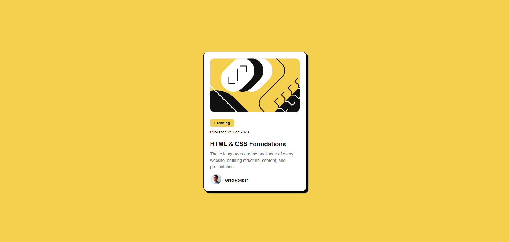

# 🌐 Blog preview project

This is a solution to the [Frontend Mentor](https://www.frontendmentor.io) challenge.  
The goal of this project was to practice **HTML and CSS** by building a responsive page. 

---

## 🚀 Demo

🔗 [Live Demo](https://leonardolaz01.github.io/Blog-Preview-Card/)

📷

---

## 🛠 Technology used
- HTML5  
- CSS3  

---

## 📂 Estrutura do projeto
📦 Blog-Preview-Card
┣ 📜 index.html
┣ 📦 Style
  ┗ 📜 style.css
┣ 📦 Images
┣ 📦 Fonts
┣ 📜 README.md
